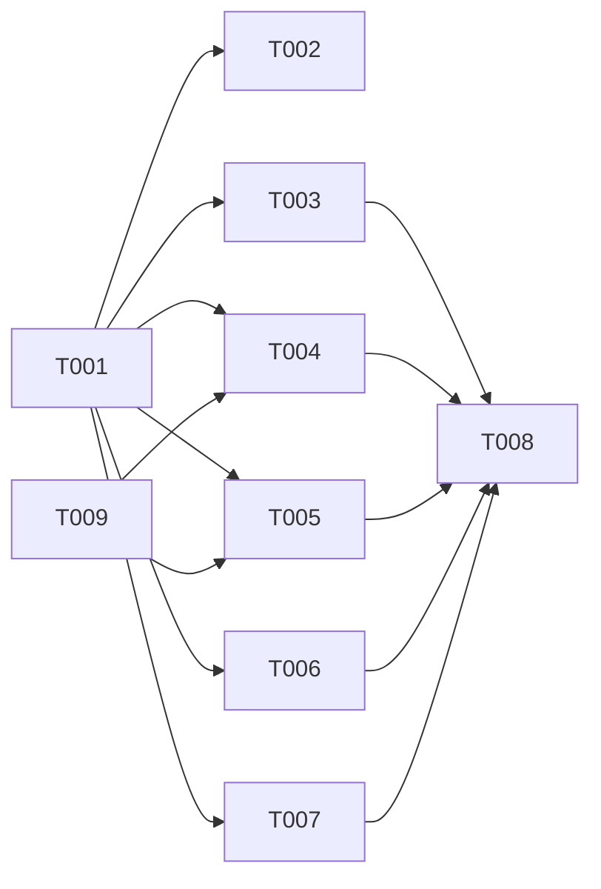

# タスクリスト - ラグジュアリーデザインリニューアル

## 1. 概要

設計書に基づくデザインリニューアルのタスク分解。
既存コンポーネントのスタイル変更と画像再生成が中心。機能変更なし。
全3フェーズ、9タスク。

## 2. タスク一覧

### Phase 1: デザイン基盤

- [ ] T001: カラーテーマ・CSS変数の変更
- [ ] T002: constants.ts のカラー定数更新
- [ ] T009: 画像再生成（Gemini API）

### Phase 2: コンポーネント刷新

- [ ] T003: スティッキーヘッダーの実装
- [ ] T004: ヒーローセクションの刷新
- [ ] T005: サービスセクションの刷新
- [ ] T006: CTAセクション・会社概要・お問い合わせページの改善

### Phase 3: 仕上げ

- [ ] T007: フッターの充実
- [ ] T008: 辞書ファイル更新・レスポンシブ確認・最終ビルド

## 3. タスク詳細

### T001: カラーテーマ・CSS変数の変更

- 要件ID: REQ-001
- 設計書参照: design.md §2.1 カラーパレット, §3.1 globals.css
- 依存関係: なし
- 推定時間: 30分
- 対象ファイル: `src/app/globals.css`
- 完了条件:
  - [ ] `@theme inline` 内の CSS 変数がダークラグジュアリーパレットに変更済み
  - [ ] `body` に `background-color` と `color` が設定済み
  - [ ] ビルドが通ること

---

### T002: constants.ts のカラー定数更新

- 要件ID: REQ-001
- 設計書参照: design.md §3.2 constants.ts
- 依存関係: T001
- 推定時間: 15分
- 対象ファイル: `src/lib/constants.ts`
- 完了条件:
  - [ ] `CORPORATE_COLOR` が新パレットに更新済み
- 並列実行: T001完了後すぐ

---

### T003: スティッキーヘッダーの実装

- 要件ID: REQ-002
- 設計書参照: design.md §3.3 Header.tsx
- 依存関係: T001
- 推定時間: 1.5時間
- 対象ファイル: `src/components/layout/Header.tsx`
- 完了条件:
  - [ ] ヘッダーが `position: fixed` で上部固定
  - [ ] 初期状態は背景透過
  - [ ] スクロール時に `backdrop-blur` + 半透明ダーク背景に変化
  - [ ] ロゴ・ナビ・言語切替が白/ライトグレーテキスト
  - [ ] モバイルハンバーガーメニューがダークテーマ
  - [ ] ヘッダー分の `pt-20` が body/main に追加されている
- 並列実行: T004, T005 と同時実行可能

---

### T004: ヒーローセクションの刷新

- 要件ID: REQ-003, REQ-004
- 設計書参照: design.md §2.2 タイポグラフィ, §3.4 HeroSection.tsx
- 依存関係: T001
- 推定時間: 1時間
- 対象ファイル: `src/components/home/HeroSection.tsx`
- 完了条件:
  - [ ] ダークオーバーレイ（`bg-black/70`）が適用済み
  - [ ] タイトルが `font-light tracking-wider` に変更
  - [ ] サブタイトルラベル（「日中不動産パートナーズ」）が追加
  - [ ] CTAボタンがゴーストボタンスタイル
  - [ ] スクロール誘導（下矢印アニメーション）が追加
  - [ ] 日本語・中国語で正しく表示
- 並列実行: T003, T005 と同時実行可能

---

### T005: サービスセクションの刷新

- 要件ID: REQ-005, REQ-010
- 設計書参照: design.md §3.5 ServiceOverview.tsx, §2.4 スペーシング
- 依存関係: T001
- 推定時間: 2時間
- 対象ファイル: `src/components/home/ServiceOverview.tsx`
- 完了条件:
  - [ ] 3カラムカード型からフルブリードセクション型に変更済み
  - [ ] 各サービスにセクション番号（01, 02, 03）が表示
  - [ ] 交互レイアウト（テキスト左/右が交互）
  - [ ] 背景色の切替（`bg-bg-secondary` と `bg-bg-primary` 交互）
  - [ ] 画像にダークオーバーレイ適用
  - [ ] セクション間パディング `py-24` 以上
  - [ ] 日本語・中国語で正しく表示
- 並列実行: T003, T004 と同時実行可能

---

### T006: CTAセクション・会社概要・お問い合わせページの改善

- 要件ID: REQ-006, REQ-007, REQ-008, REQ-010
- 設計書参照: design.md §3.6, §3.7, §3.8
- 依存関係: T001
- 推定時間: 2時間
- 対象ファイル:
  - `src/components/home/CTASection.tsx`
  - `src/app/[lang]/about/page.tsx`
  - `src/components/about/CompanyInfo.tsx`
  - `src/components/about/Mission.tsx`
  - `src/app/[lang]/contact/page.tsx`
  - `src/components/contact/ContactForm.tsx`
- 完了条件:
  - [ ] CTAセクション: ゴールドアクセントライン + ゴーストボタン
  - [ ] 会社概要: ダークヒーローセクション追加
  - [ ] 会社概要: テーブルがダークテーマ（ゴールドアクセント）
  - [ ] 企業理念: ダーク背景 + 余白拡大
  - [ ] お問い合わせ: ダークヒーローセクション追加
  - [ ] フォーム入力欄がダークテーマ（`bg-bg-tertiary`, `border-border`）
  - [ ] 送信ボタンがゴーストボタンスタイル
  - [ ] すべてのページでレスポンシブ表示が崩れないこと
- 並列実行: T003, T004, T005 と同時実行可能

---

### T007: フッターの充実

- 要件ID: REQ-009
- 設計書参照: design.md §3.9 Footer.tsx
- 依存関係: T001
- 推定時間: 1時間
- 対象ファイル: `src/components/layout/Footer.tsx`
- 完了条件:
  - [ ] 背景が `#050505` に変更
  - [ ] ゴールドグラデーションラインが上部に追加
  - [ ] 3カラム構成（会社情報 / ナビ / お問い合わせ）
  - [ ] コピーライトセクションが分離
  - [ ] 日本語・中国語で正しく表示
- 並列実行: T003〜T006 と同時実行可能

---

### T008: 辞書ファイル更新・レスポンシブ確認・最終ビルド

- 要件ID: NFR-001, NFR-002, NFR-003, NFR-004
- 設計書参照: design.md §4 辞書ファイル変更
- 依存関係: T003, T004, T005, T006, T007
- 推定時間: 1時間
- 対象ファイル:
  - `src/i18n/ja.json`
  - `src/i18n/zh.json`
- 完了条件:
  - [ ] 新規辞書キー（hero_label, services_label, footer系）が追加済み
  - [ ] ja.json と zh.json のキー構造が一致
  - [ ] モバイル（375px）、タブレット（768px）、デスクトップで崩れなし
  - [ ] テキストコントラスト比が WCAG AA 準拠
  - [ ] `npm run lint` パス
  - [ ] `npm run build` 成功
  - [ ] Netlify デプロイ可能な状態

### T009: 画像再生成（Gemini API）

- 要件ID: ASM-002
- 設計書参照: requirement.md §6 画像再生成仕様, design.md §5 画像再生成
- 依存関係: なし（T001と並列実行可能）
- 推定時間: 30分
- 対象ファイル:
  - `scripts/prompts.json`
  - `public/images/hero-bg.webp`
  - `public/images/service-consulting.webp`
  - `public/images/service-brokerage.webp`
  - `public/images/service-viewing.webp`
  - `public/images/about-mission.webp`
  - `public/images/ogp-ja.png`
  - `public/images/ogp-zh.png`
- 完了条件:
  - [ ] `scripts/prompts.json` が requirement.md §6.3 の新プロンプトに更新済み
  - [ ] `scripts/generate_image.py` で全7画像の再生成が完了
  - [ ] 生成画像がフォトリアリスティックで、イラスト風でないこと
  - [ ] 画像内にテキスト・文字・ウォーターマークが含まれていないこと
  - [ ] OGP画像（ogp-ja, ogp-zh）は正しいテキストが表示されていること
  - [ ] 各画像が指定サイズ（hero: 1920x1080, service: 800x600, mission: 1200x800, ogp: 1200x630）であること
- 並列実行: T001 と同時実行可能

---

## 4. 依存関係図

## 5. 並列実行計画

| フェーズ | 並列実行可能タスク | 推定時間 |
|---------|-------------------|---------|
| 1 | T001, T009 | 30分（並列） |
| 1.5 | T002 | 15分 |
| 2 | T003, T004, T005, T006, T007 | 2h（並列） |
| 3 | T008 | 1h |

**合計推定時間**: 直列 9.75h → 並列最適化で **約 3.75h**（T009はT001と並列実行）
