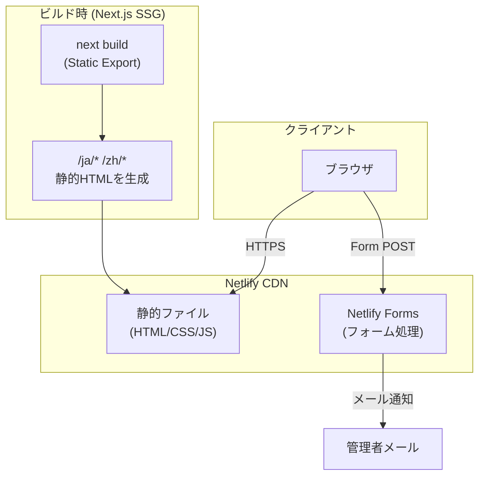
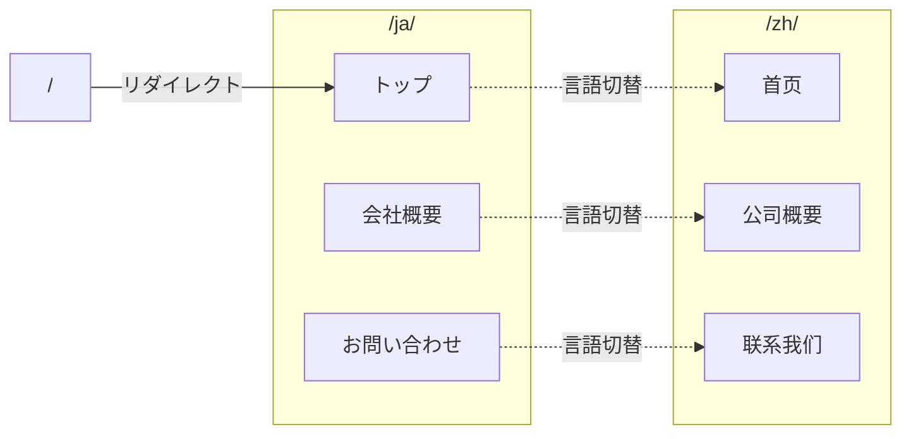

# 技術設計書 - 日中不動産パートナーズ株式会社 コーポレートサイト

## 1. 要件トレーサビリティマトリックス

| 要件ID | 要件内容 | 設計項目 | 既存資産 | 新規理由 |
|--------|---------|---------|---------|---------|
| REQ-001 | トップページ | HeroSection, ServiceOverview, CTASection | ❌新規 | 新規プロジェクト |
| REQ-002 | 会社概要ページ | AboutPage コンポーネント | ❌新規 | 新規プロジェクト |
| REQ-003 | お問い合わせページ | ContactForm (Netlify Forms) | ❌新規 | 新規プロジェクト |
| REQ-004 | 多言語対応 | i18n ルーティング + 辞書ファイル | ❌新規 | 新規プロジェクト |
| REQ-005 | ヘッダー | Header コンポーネント | ❌新規 | 新規プロジェクト |
| REQ-006 | フッター | Footer コンポーネント | ❌新規 | 新規プロジェクト |
| REQ-007 | アニメーション演出 | Framer Motion + CSS Animations | ❌新規 | 新規プロジェクト |
| REQ-008 | 画像素材生成 | Gemini API + generate_image.py | ❌新規 | AI画像生成パイプライン |

## 2. アーキテクチャ概要

### 2.1 システム構成図



### 2.2 ルーティング構造



## 3. 技術スタック

| カテゴリ | 技術 | バージョン | 選定理由 |
|---------|------|----------|---------|
| フレームワーク | Next.js | 15.x | SSG対応、Reactエコシステム |
| 言語 | TypeScript | 5.x | 型安全性 |
| スタイリング | Tailwind CSS | 4.x | ユーティリティファースト、高速開発 |
| アニメーション | Framer Motion | 11.x | React 向け最有力、SSG互換性良好 |
| フォーム | Netlify Forms | - | サーバーレス、DB不要 |
| ホスティング | Netlify | Free tier | 無料、CDN、自動デプロイ |
| パッケージマネージャ | npm | - | 標準 |
| 画像生成 | Gemini API (google-genai) | - | AI による画像素材自動生成 |

### 3.1 Remotion vs Framer Motion の判断

| 観点 | Remotion | Framer Motion |
|------|---------|---------------|
| 主用途 | 動画生成 | Webアニメーション |
| SSG互換性 | △ サーバーサイド処理が前提 | ◎ クライアントサイドで完結 |
| バンドルサイズ | 大（動画エンジン含む） | 小（アニメーションのみ） |
| スクロールアニメ | 非対応 | ネイティブ対応 |
| Netlify無料枠 | △ ビルド時間の懸念 | ◎ 問題なし |

**判断**: Framer Motion を採用。Remotion は動画生成ライブラリであり、コーポレートサイトのWebアニメーションには Framer Motion の方が適切。スクロールトリガー、ページ遷移、インタラクションアニメーションすべてに対応可能。

## 4. ディレクトリ構成

```
nicchu-fudosan-partners/
├── public/
│   ├── images/
│   │   ├── hero/             # ヒーロー背景画像（Gemini生成）
│   │   ├── services/         # サービスアイコン/イラスト（Gemini生成）
│   │   ├── about/            # 会社概要用画像（Gemini生成）
│   │   └── ogp/              # OGP画像（Gemini生成）
│   └── favicon.ico
├── scripts/
│   ├── generate_image.py     # Gemini API 画像生成スクリプト
│   ├── generate_all_assets.sh # 全画像一括生成シェルスクリプト
│   ├── prompts.json          # 画像生成プロンプト定義
│   └── requirements.txt      # Python依存関係（google-genai, Pillow）
├── .env.example              # 環境変数テンプレート
├── src/
│   ├── app/
│   │   ├── [lang]/              # 動的言語ルーティング
│   │   │   ├── page.tsx         # トップページ
│   │   │   ├── about/
│   │   │   │   └── page.tsx     # 会社概要
│   │   │   ├── contact/
│   │   │   │   └── page.tsx     # お問い合わせ
│   │   │   └── layout.tsx       # 言語別レイアウト
│   │   ├── layout.tsx           # ルートレイアウト
│   │   └── page.tsx             # / → /ja/ リダイレクト
│   ├── components/
│   │   ├── layout/
│   │   │   ├── Header.tsx
│   │   │   └── Footer.tsx
│   │   ├── home/
│   │   │   ├── HeroSection.tsx      # ファーストビュー
│   │   │   ├── ServiceOverview.tsx   # サービス概要
│   │   │   └── CTASection.tsx       # 問い合わせ導線
│   │   ├── about/
│   │   │   ├── CompanyInfo.tsx      # 会社基本情報
│   │   │   └── Mission.tsx          # 理念・ミッション
│   │   ├── contact/
│   │   │   └── ContactForm.tsx      # 問い合わせフォーム
│   │   └── animations/
│   │       ├── FadeInSection.tsx     # スクロールフェードイン
│   │       ├── ParallaxHero.tsx      # パララックスヒーロー
│   │       └── PageTransition.tsx    # ページ遷移
│   ├── i18n/
│   │   ├── dictionaries.ts          # 辞書読み込みロジック
│   │   ├── ja.json                  # 日本語辞書
│   │   └── zh.json                  # 中国語辞書
│   └── lib/
│       └── constants.ts             # 定数定義
├── next.config.ts
├── tailwind.config.ts
├── tsconfig.json
├── netlify.toml
└── package.json
```

## 5. モジュール・コンポーネント設計

### [REQ-004] 多言語対応

> 📌 要件: `/ja/` パスで日本語、`/zh/` パスで中国語ページを表示

**ルーティング方式**: Next.js App Router の動的ルーティング `[lang]` を使用

```typescript
// src/app/[lang]/layout.tsx
type Lang = "ja" | "zh";

export function generateStaticParams() {
  return [{ lang: "ja" }, { lang: "zh" }];
}
```

**辞書構造**:
```typescript
// src/i18n/ja.json
{
  "common": {
    "company_name": "日中不動産パートナーズ株式会社",
    "nav": { "home": "トップ", "about": "会社概要", "contact": "お問い合わせ" },
    "lang_switch": "中文"
  },
  "home": {
    "hero_title": "...",
    "hero_subtitle": "..."
  },
  "about": { ... },
  "contact": { ... }
}
```

**辞書読み込み**:
```typescript
// src/i18n/dictionaries.ts
const dictionaries = {
  ja: () => import("./ja.json").then((m) => m.default),
  zh: () => import("./zh.json").then((m) => m.default),
};

export const getDictionary = async (lang: "ja" | "zh") => dictionaries[lang]();
```

### [REQ-001] トップページ

> 📌 要件: インパクトのあるアニメーション演出、サービス概要、CTA

**構成**:
1. `HeroSection` - フルスクリーンヒーロー + パーティクル/パララックスアニメーション
2. `ServiceOverview` - 3カラムでサービス紹介（投資コンサル/仲介/内見サポート）
3. `CTASection` - 問い合わせへの大きなボタン

### [REQ-003] お問い合わせフォーム

> 📌 要件: Netlify Forms でDB不要のフォーム送信

```tsx
// ContactForm.tsx の基本構造
<form
  name="contact"
  method="POST"
  data-netlify="true"
  netlify-honeypot="bot-field"
>
  <input type="hidden" name="form-name" value="contact" />
  <p hidden><input name="bot-field" /></p>
  {/* 氏名、メール、電話（任意）、種別、内容 */}
</form>
```

**注意**: Next.js SSG + Netlify Forms の組み合わせでは、`data-netlify="true"` を含む `<form>` がビルド時の HTML に存在する必要がある。

### [REQ-007] アニメーション設計

> 📌 要件: モダンアニメーション演出

| コンポーネント | アニメーション内容 | Framer Motion API |
|-------------|-----------------|------------------|
| HeroSection | パララックス背景 + テキストフェードイン | `useScroll`, `useTransform` |
| ServiceOverview | スクロールで各カード順次表示 | `whileInView`, `staggerChildren` |
| CTASection | ホバーでボタン拡大 | `whileHover`, `whileTap` |
| FadeInSection | 汎用スクロールフェードイン | `whileInView`, `initial/animate` |
| PageTransition | ページ遷移フェード | `AnimatePresence`, `motion.div` |

**`prefers-reduced-motion` 対応**:
```typescript
const prefersReducedMotion =
  typeof window !== "undefined"
    ? window.matchMedia("(prefers-reduced-motion: reduce)").matches
    : false;
```

## 6. 画像生成パイプライン

### 6.1 概要

コーポレートサイトの画像素材を Gemini API（google-genai SDK）で自動生成する。
ZenchainWeb の `/write-article` スキルと同じパターンを踏襲。

### 6.2 生成対象画像

| 画像 | 用途 | 出力先 | サイズ目安 |
|------|------|--------|----------|
| hero-bg.png | トップページヒーロー背景 | `public/images/hero/` | 1920x1080 |
| service-consulting.png | 投資コンサルサービス | `public/images/services/` | 800x600 |
| service-brokerage.png | 仲介サービス | `public/images/services/` | 800x600 |
| service-viewing.png | 内見サポートサービス | `public/images/services/` | 800x600 |
| about-mission.png | 企業理念セクション | `public/images/about/` | 1200x800 |
| ogp-ja.png | OGP画像（日本語） | `public/images/ogp/` | 1200x630 |
| ogp-zh.png | OGP画像（中国語） | `public/images/ogp/` | 1200x630 |

### 6.3 環境変数

ZenchainWeb の `/write-article` スキルと同じ Gemini API キーを共有利用する。

```bash
# .env（ZenchainWeb から API キーをコピー）
# ソース: ~/Documents/zenchaine/ZenchainWeb/.claude/skills/write-article/.env
GEMINI_API_KEY=<ZenchainWebと同じキー>
```

セットアップ時に既存の `.env` からキーをコピー:
```bash
# ZenchainWeb の .env から GEMINI_API_KEY を取得して .env を作成
grep GEMINI_API_KEY ~/Documents/zenchaine/ZenchainWeb/.claude/skills/write-article/.env > .env
```

画像生成の実行前に `.env` を読み込む:
```bash
set -a && source .env && set +a
```

API キーが未設定の場合はプレースホルダー画像で構築を続行する。

### 6.4 Python スクリプト（generate_image.py）

ZenchainWeb の `generate_image.py` と同じアーキテクチャ:

```python
# scripts/generate_image.py
# google-genai SDK で Gemini API を呼び出し、画像を生成
#
# 使い方:
#   python scripts/generate_image.py "プロンプト" --output public/images/hero/hero-bg.png
#   python scripts/generate_image.py --from-config scripts/prompts.json --key hero-bg
```

**依存関係** (`scripts/requirements.txt`):
```
google-genai>=1.0.0
Pillow>=10.0.0
```

**セットアップ**:
```bash
cd scripts && python -m venv venv && pip install -r requirements.txt
```

### 6.5 プロンプト定義（prompts.json）

```json
{
  "hero-bg": {
    "prompt": "Modern abstract cityscape blending Tokyo and Shanghai skylines, professional real estate theme, blue and gold color scheme, clean geometric patterns, suitable for corporate website hero background, photorealistic, wide aspect ratio 16:9",
    "output": "public/images/hero/hero-bg.png",
    "size": "1920x1080"
  },
  "service-consulting": {
    "prompt": "Professional illustration of real estate investment consulting, business meeting between Japanese and Chinese professionals, modern office setting, warm and trustworthy atmosphere, clean flat design style",
    "output": "public/images/services/service-consulting.png",
    "size": "800x600"
  },
  "service-brokerage": {
    "prompt": "Professional illustration of real estate brokerage, property viewing and negotiation, Japanese real estate market, modern apartment building, clean flat design style",
    "output": "public/images/services/service-brokerage.png",
    "size": "800x600"
  },
  "service-viewing": {
    "prompt": "Professional illustration of property viewing support for Chinese investors in Japan, guided tour of Japanese residential property, welcoming atmosphere, clean flat design style",
    "output": "public/images/services/service-viewing.png",
    "size": "800x600"
  },
  "about-mission": {
    "prompt": "Abstract illustration representing Japan-China business partnership bridge, cherry blossom and plum blossom motifs, professional and harmonious, corporate style",
    "output": "public/images/about/about-mission.png",
    "size": "1200x800"
  },
  "ogp-ja": {
    "prompt": "Professional OGP image for Japanese-Chinese real estate company, company name '日中不動産パートナーズ', blue and gold corporate color scheme, modern design, 1200x630",
    "output": "public/images/ogp/ogp-ja.png",
    "size": "1200x630"
  },
  "ogp-zh": {
    "prompt": "Professional OGP image for Japanese-Chinese real estate company, company name '日中不动产合伙人', blue and gold corporate color scheme, modern design, 1200x630",
    "output": "public/images/ogp/ogp-zh.png",
    "size": "1200x630"
  }
}
```

### 6.6 一括生成スクリプト（generate_all_assets.sh）

```bash
#!/bin/bash
# scripts/generate_all_assets.sh
# 全画像素材を一括生成

set -a && source .env && set +a

SCRIPT_DIR="$(cd "$(dirname "$0")" && pwd)"
PYTHON="${SCRIPT_DIR}/venv/bin/python"
GENERATOR="${SCRIPT_DIR}/generate_image.py"

# venv チェック
if [ ! -f "$PYTHON" ]; then
  echo "Setting up Python venv..."
  cd "$SCRIPT_DIR" && python -m venv venv && venv/bin/pip install -r requirements.txt
fi

# prompts.json の各エントリを順次実行
for key in $(jq -r 'keys[]' "$SCRIPT_DIR/prompts.json"); do
  prompt=$(jq -r ".\"$key\".prompt" "$SCRIPT_DIR/prompts.json")
  output=$(jq -r ".\"$key\".output" "$SCRIPT_DIR/prompts.json")
  echo "Generating: $key → $output"
  timeout 120 "$PYTHON" "$GENERATOR" "$prompt" --output "$output" || echo "WARN: $key failed, using placeholder"
done
```

### 6.7 フォールバック（プレースホルダー）

Gemini API が利用できない場合（APIキー未設定 / クォータ超過 / エラー）:

1. **初期構築時**: CSS グラデーション + テキストのプレースホルダーを使用
2. **コンポーネント側**: `<Image>` に `onError` ハンドラーでフォールバック表示
3. **後から差し替え可能**: `public/images/` に画像を配置すれば自動的に反映

```tsx
// プレースホルダーパターン
const ImageWithFallback = ({ src, alt, ...props }) => {
  const [error, setError] = useState(false);
  if (error) {
    return (
      <div className="bg-gradient-to-br from-blue-900 to-amber-700 flex items-center justify-center">
        <span className="text-white/50 text-sm">{alt}</span>
      </div>
    );
  }
  return <Image src={src} alt={alt} onError={() => setError(true)} {...props} />;
};
```

## 7. 技術的決定事項

| 決定項目 | 選択 | 理由 |
|---------|------|------|
| SSGビルド方式 | `output: "export"` | Netlify 無料枠との互換性 |
| アニメーション | Framer Motion | SSG互換性、バンドルサイズ、スクロールアニメーション対応 |
| スタイリング | Tailwind CSS | 高速開発、レスポンシブ対応が容易 |
| 多言語方式 | `[lang]` 動的ルーティング + JSON辞書 | シンプル、SSG互換、ライブラリ不要 |
| フォーム | Netlify Forms（HTML属性方式） | サーバーレス、DB不要、無料 |
| リダイレクト | `netlify.toml` | `/` → `/ja/` のリダイレクト設定 |
| 画像生成 | Gemini API (google-genai) | AI生成でデザイナー不要、プロンプトで再生成可能 |

## 8. 実装ガイドライン

### コーディング規約
- TypeScript strict モード有効
- コンポーネントは関数コンポーネント + アロー関数
- ファイル名: PascalCase（コンポーネント）、camelCase（ユーティリティ）
- CSS クラス: Tailwind ユーティリティクラスを使用

### SEO 対策
- 各ページの `generateMetadata` で title, description, OGP を設定
- `[lang]/layout.tsx` で `<html lang={lang}>` を動的設定
- `hreflang` の相互参照リンクをメタデータに含める

### デプロイ設定
```toml
# netlify.toml
[build]
  command = "npm run build"
  publish = "out"

[[redirects]]
  from = "/"
  to = "/ja/"
  status = 302
```
