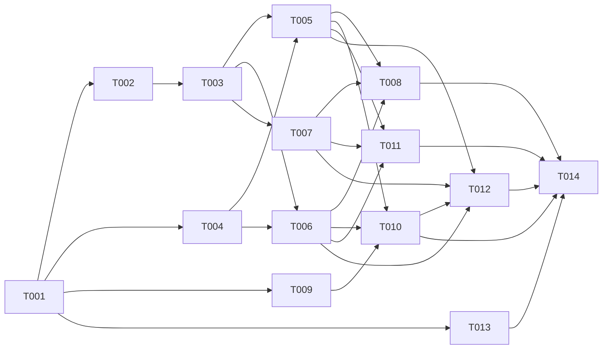

# タスクリスト - 日中不動産パートナーズ株式会社 コーポレートサイト

## 1. 概要

設計書に基づくタスク分解。Next.js SSG + Netlify の静的コーポレートサイト。
全4フェーズ、14タスク。

## 2. タスク一覧

### Phase 1: プロジェクト基盤

- [x] T001: Next.js プロジェクト初期セットアップ
- [ ] T002: 多言語ルーティング基盤の実装
- [ ] T003: 共通レイアウト（Header/Footer）の実装

### Phase 2: ページ・コンポーネント実装

- [ ] T004: アニメーション基盤コンポーネントの実装
- [ ] T005: トップページの実装
- [ ] T006: 会社概要ページの実装
- [ ] T007: お問い合わせページ・フォームの実装
- [ ] T008: 多言語辞書ファイル（ja.json / zh.json）の作成

### Phase 3: 画像生成パイプライン

- [ ] T009: Gemini 画像生成スクリプトのセットアップ
- [ ] T010: 全画像素材の生成・配置

### Phase 4: 品質・デプロイ

- [ ] T011: レスポンシブデザイン調整
- [ ] T012: SEO・メタデータ設定
- [ ] T013: Netlify デプロイ設定
- [ ] T014: 最終動作確認・Lighthouse チェック

## 3. タスク詳細

### T001: Next.js プロジェクト初期セットアップ

- 要件ID: CON-002
- 設計書参照: design.md §3 技術スタック, §4 ディレクトリ構成
- 依存関係: なし
- 推定時間: 1時間
- 対象ファイル: `package.json`, `next.config.ts`, `tailwind.config.ts`, `tsconfig.json`
- 完了条件:
  - [x] `create-next-app` で TypeScript + Tailwind CSS のプロジェクトが作成済み
  - [x] Framer Motion がインストール済み
  - [x] `next.config.ts` に `output: "export"` が設定済み
  - [x] `npm run build` が正常に完了する

---

### T002: 多言語ルーティング基盤の実装

- 要件ID: REQ-004
- 設計書参照: design.md §5 [REQ-004] 多言語対応
- 依存関係: T001
- 推定時間: 2時間
- 対象ファイル:
  - `src/app/[lang]/layout.tsx`
  - `src/app/[lang]/page.tsx`
  - `src/app/page.tsx`（リダイレクト）
  - `src/i18n/dictionaries.ts`
  - `src/i18n/ja.json`（骨格のみ）
  - `src/i18n/zh.json`（骨格のみ）
- 完了条件:
  - [ ] `/ja/` と `/zh/` でそれぞれ対応言語のページが表示される
  - [ ] `/` アクセスで `/ja/` にリダイレクトされる
  - [ ] `generateStaticParams` で `ja`, `zh` の静的パスが生成される
  - [ ] 辞書の読み込み関数が動作する

---

### T003: 共通レイアウト（Header/Footer）の実装

- 要件ID: REQ-005, REQ-006
- 設計書参照: design.md §4 ディレクトリ構成, §5 コンポーネント設計
- 依存関係: T002
- 推定時間: 2時間
- 対象ファイル:
  - `src/components/layout/Header.tsx`
  - `src/components/layout/Footer.tsx`
- 完了条件:
  - [ ] ヘッダーにロゴ、ナビゲーション、言語切替ボタンが表示される
  - [ ] フッターに会社情報、コピーライト、ページリンクが表示される
  - [ ] 言語切替ボタンで `/ja/` ⇄ `/zh/` を遷移できる
  - [ ] モバイルでハンバーガーメニューに切り替わる

---

### T004: アニメーション基盤コンポーネントの実装

- 要件ID: REQ-007
- 設計書参照: design.md §5 [REQ-007] アニメーション設計
- 依存関係: T001
- 推定時間: 2時間
- 対象ファイル:
  - `src/components/animations/FadeInSection.tsx`
  - `src/components/animations/ParallaxHero.tsx`
  - `src/components/animations/PageTransition.tsx`
- 完了条件:
  - [ ] `FadeInSection` でスクロール時のフェードインが動作する
  - [ ] `ParallaxHero` でパララックス効果が動作する
  - [ ] `PageTransition` でページ遷移アニメーションが動作する
  - [ ] `prefers-reduced-motion` 設定時にアニメーションが無効化される
- 並列実行: T002, T003 と同時実行可能

---

### T005: トップページの実装

- 要件ID: REQ-001
- 設計書参照: design.md §5 [REQ-001] トップページ
- 依存関係: T003, T004
- 推定時間: 3時間
- 対象ファイル:
  - `src/app/[lang]/page.tsx`
  - `src/components/home/HeroSection.tsx`
  - `src/components/home/ServiceOverview.tsx`
  - `src/components/home/CTASection.tsx`
- 完了条件:
  - [ ] ファーストビューにアニメーション付きヒーローセクションが表示される
  - [ ] サービス概要（投資コンサル/仲介/内見サポート）が3カラムで表示される
  - [ ] CTAボタンからお問い合わせページに遷移できる
  - [ ] 日本語・中国語で正しいテキストが表示される

---

### T006: 会社概要ページの実装

- 要件ID: REQ-002
- 設計書参照: design.md §5
- 依存関係: T003, T004
- 推定時間: 2時間
- 対象ファイル:
  - `src/app/[lang]/about/page.tsx`
  - `src/components/about/CompanyInfo.tsx`
  - `src/components/about/Mission.tsx`
- 完了条件:
  - [ ] 会社基本情報（日中不動産パートナーズ株式会社、代表: 太田翔子、所在地等）が表示される
  - [ ] 企業理念・ミッションセクションが表示される
  - [ ] スクロールアニメーションが適用されている
  - [ ] 日本語・中国語で正しいテキストが表示される
- 並列実行: T005 と同時実行可能

---

### T007: お問い合わせページ・フォームの実装

- 要件ID: REQ-003
- 設計書参照: design.md §5 [REQ-003] お問い合わせフォーム
- 依存関係: T003
- 推定時間: 3時間
- 対象ファイル:
  - `src/app/[lang]/contact/page.tsx`
  - `src/components/contact/ContactForm.tsx`
- 完了条件:
  - [ ] フォームに氏名、メール、電話番号（任意）、種別、内容の入力欄がある
  - [ ] `data-netlify="true"` と `netlify-honeypot` が設定されている
  - [ ] 必須項目チェック、メール形式バリデーションが動作する
  - [ ] 送信完了メッセージが表示される
  - [ ] 日本語・中国語でフォームラベルが正しく表示される
- 並列実行: T005, T006 と同時実行可能

---

### T008: 多言語辞書ファイル（ja.json / zh.json）の作成

- 要件ID: REQ-004
- 設計書参照: design.md §5 [REQ-004] 辞書構造
- 依存関係: T005, T006, T007（全ページのテキストキーが確定後）
- 推定時間: 2時間
- 対象ファイル:
  - `src/i18n/ja.json`
  - `src/i18n/zh.json`
- 完了条件:
  - [ ] 全ページのテキストが辞書ファイルに定義されている
  - [ ] 日本語と中国語の辞書構造が一致している
  - [ ] ハードコードされたテキストがない

---

### T009: Gemini 画像生成スクリプトのセットアップ

- 要件ID: REQ-008
- 設計書参照: design.md §6 画像生成パイプライン
- 依存関係: T001
- 推定時間: 2時間
- 対象ファイル:
  - `scripts/generate_image.py`
  - `scripts/generate_all_assets.sh`
  - `scripts/prompts.json`
  - `scripts/requirements.txt`
  - `.env.example`
- 完了条件:
  - [ ] `scripts/generate_image.py` が google-genai SDK で画像生成できる
  - [ ] `scripts/prompts.json` に全7画像のプロンプトが定義されている
  - [ ] `scripts/generate_all_assets.sh` で一括生成が動作する
  - [ ] Python venv のセットアップが正常に完了する
  - [ ] API キー未設定時にエラーメッセージが表示される（クラッシュしない）
- 並列実行: T002〜T007 と同時実行可能

---

### T010: 全画像素材の生成・配置

- 要件ID: REQ-008
- 設計書参照: design.md §6.2 生成対象画像
- 依存関係: T009, T005, T006（画像の利用箇所が確定後）
- 推定時間: 1時間
- 対象ファイル:
  - `public/images/hero/hero-bg.png`
  - `public/images/services/service-consulting.png`
  - `public/images/services/service-brokerage.png`
  - `public/images/services/service-viewing.png`
  - `public/images/about/about-mission.png`
  - `public/images/ogp/ogp-ja.png`
  - `public/images/ogp/ogp-zh.png`
- 完了条件:
  - [ ] `generate_all_assets.sh` を実行して全画像が生成される
  - [ ] 生成画像がコンポーネントから正しく参照・表示される
  - [ ] プロンプト調整により品質が許容レベルに達している
  - [ ] 生成失敗時はプレースホルダー（CSS グラデーション）で代替表示される

---

### T011: レスポンシブデザイン調整

- 要件ID: NFR-002
- 設計書参照: design.md §8
- 依存関係: T005, T006, T007
- 推定時間: 2時間
- 対象ファイル: 各コンポーネント
- 完了条件:
  - [ ] モバイル（375px）、タブレット（768px）、デスクトップ（1024px）で崩れがない
  - [ ] ハンバーガーメニューがモバイルで正しく動作する
  - [ ] アニメーションがモバイルでもスムーズに動作する

---

### T012: SEO・メタデータ設定

- 要件ID: NFR-003
- 設計書参照: design.md §8 SEO対策
- 依存関係: T005, T006, T007, T010
- 推定時間: 1.5時間
- 対象ファイル:
  - `src/app/[lang]/layout.tsx`
  - 各ページの `generateMetadata`
  - `public/robots.txt`
- 完了条件:
  - [ ] 各ページに title, description, OGP メタタグが設定されている
  - [ ] `<html lang>` が言語に応じて動的に設定されている
  - [ ] `hreflang` で `/ja/` ⇄ `/zh/` の関係が明示されている
  - [ ] OGP画像（ogp-ja.png / ogp-zh.png）が正しく参照されている
  - [ ] `robots.txt` と `sitemap.xml` が生成される
- 並列実行: T011 と同時実行可能

---

### T013: Netlify デプロイ設定

- 要件ID: CON-001
- 設計書参照: design.md §8 デプロイ設定
- 依存関係: T001
- 推定時間: 1時間
- 対象ファイル:
  - `netlify.toml`
- 完了条件:
  - [ ] `netlify.toml` にビルドコマンド、公開ディレクトリが設定されている
  - [ ] `/` → `/ja/` のリダイレクトが設定されている
  - [ ] Netlify Forms の通知設定方法がドキュメント化されている
  - [ ] `npm run build` の成果物が `out/` に正しく出力される
- 並列実行: T002〜T010 と同時実行可能

---

### T014: 最終動作確認・Lighthouse チェック

- 要件ID: NFR-001, NFR-004
- 設計書参照: design.md §8
- 依存関係: T008, T010, T011, T012, T013
- 推定時間: 1.5時間
- 対象ファイル: -
- 完了条件:
  - [ ] 全ページが `/ja/` `/zh/` 両方で正しく表示される
  - [ ] Netlify Forms のテスト送信が成功する
  - [ ] Lighthouse スコア 90+ (Performance, Accessibility, Best Practices, SEO)
  - [ ] `prefers-reduced-motion` 対応が確認済み

## 4. 依存関係図

## 5. 並列実行計画

| フェーズ | 並列実行可能タスク | 推定時間 |
|---------|-------------------|---------|
| 1 | T001 | 1h |
| 2 | T002, T004, T009, T013 | 2h |
| 3 | T003 | 2h |
| 4 | T005, T006, T007 | 3h（並列） |
| 5 | T008, T010, T011, T012 | 2h（並列） |
| 6 | T014 | 1.5h |

**合計推定時間**: 直列 26h → 並列最適化で **約 11.5h**
