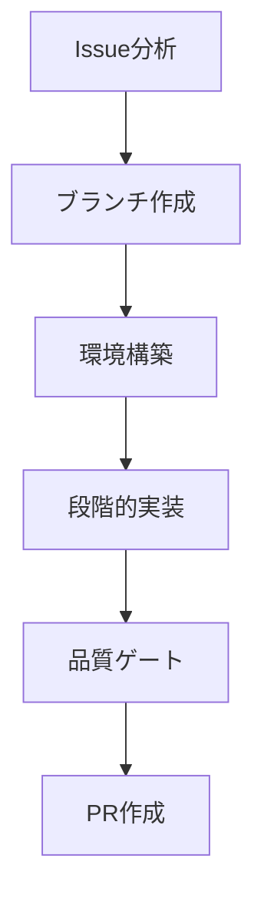

# Issue to PR ワークフローガイド

> spec-workflow-init により自動生成されました。
> 生成日時: 2026-03-03

## ワークフロー概要



## 開発環境

- **言語 / フレームワーク**: TypeScript / Next.js 15
- **パッケージマネージャ**: npm
- **コンテナ**: なし
- **データベース**: なし
- **テストフレームワーク**: なし（ビルド通過のみ）
- **CI/CD**: なし
- **ブランチ戦略**: GitHub Flow
- **ブランチ命名**: `feature/{issue}-{slug}`
- **PRターゲット**: `main`
- **開発スタイル**: Implementation First

## 1. Issue分析とセットアップ

### Issue情報の取得

```bash
gh issue view {issue_number}
```

Issueを注意深く読み、以下を特定する:
- 受け入れ基準
- 技術的な制約
- 関連するIssueやPR

### 仕様書の確認

```bash
ls .specs/nicchu-fudosan-partners/
cat .specs/nicchu-fudosan-partners/requirement.md
cat .specs/nicchu-fudosan-partners/design.md
cat .specs/nicchu-fudosan-partners/tasks.md
```

### featureブランチの作成

```bash
git checkout main
git pull origin main
git checkout -b feature/{issue_number}-{slug}
```

## 2. 環境構築

```bash
npm install
```

## 3. 段階的実装

### Phase 1: 分析と設計

- 関連するソースコードを読み、既存のパターンを理解する
- 依存関係と影響範囲を特定する
- 実装方針を計画する

### Phase 2: コア実装

コーディングルール（`docs/coding-rules.md`）に従って機能を実装する。

```bash
# 開発サーバーを起動して変更を確認
npm run dev
```

### Phase 3: コードレビュー

実装コードをレビューする:
- coding-rules.md への準拠を確認
- セキュリティ脆弱性のチェック
- 適切なエラーハンドリングの確認

### Phase 4: 品質ゲート

```bash
npm run lint
npm run build
```

## 4. PR作成と品質ゲート

### PR作成前チェックリスト

- [ ] Lint通過: `npm run lint`
- [ ] ビルド成功: `npm run build`
- [ ] 全ページが `/ja/` `/zh/` で正しく表示される（目視確認）

### PR作成

```bash
gh pr create --base main --title "feat: {description} (closes #{issue_number})" --body "## 概要
- {summary_points}

## テスト計画
- [ ] `npm run build` が成功する
- [ ] `/ja/` `/zh/` 両方でページが正しく表示される

## 関連
- Closes #{issue_number}
- 仕様書: .specs/nicchu-fudosan-partners/
"
```

---

> このワークフローは spec-workflow-init で生成されました。プロジェクトの成長に合わせてカスタマイズしてください。
